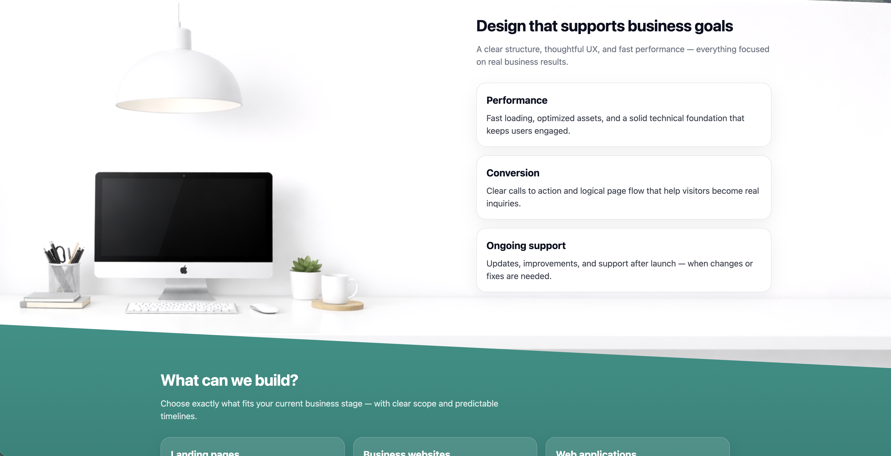
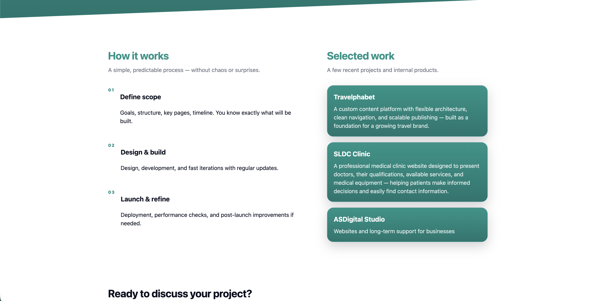

# ASDigital Studio — Portfolio Website

Production-ready portfolio website for **ASDigital Studio**, built with Django.

The project demonstrates a clean architecture, responsive UI, and a real-world deployment workflow used in production.

---

## 🚀 Live website

👉 https://asdigital.kz

---

## 🖼 Screenshots

### Home / Hero section

### Design & approach

### Works & structure

### Contact & inquiry

---

## 🧩 Tech stack

- Backend: Django 5
- Frontend: HTML5, CSS3, Vanilla JavaScript
- Styling: Custom responsive layout (mobile-first)
- Server: Linux, Nginx, Gunicorn
- Deployment: systemd + UNIX socket
- Version control: Git, GitHub

---

## ✨ Features

- Responsive landing page (mobile / tablet / desktop)
- Clean UI focused on conversions
- Contact form with email notifications
- Optimized static assets
- Production-safe configuration (.env excluded from repo)
- Real deployment setup (not a demo project)

---

## 📂 Project structure
asdigital/
├── config/          Django project settings
├── portfolio/       Main app
├── templates/       HTML templates
├── static/          Static assets (CSS, images)
├── manage.py
└── README.md

---

## 🔒 Security

- Secrets stored in `.env` (not tracked)
- Production settings separated
- Clean Git history (no leaked keys)

---

## 👤 Author

**Anton Danchev**  
Full-Stack Web Developer  

GitHub: https://github.com/asdanchev  
Website: https://asdigital.kz
